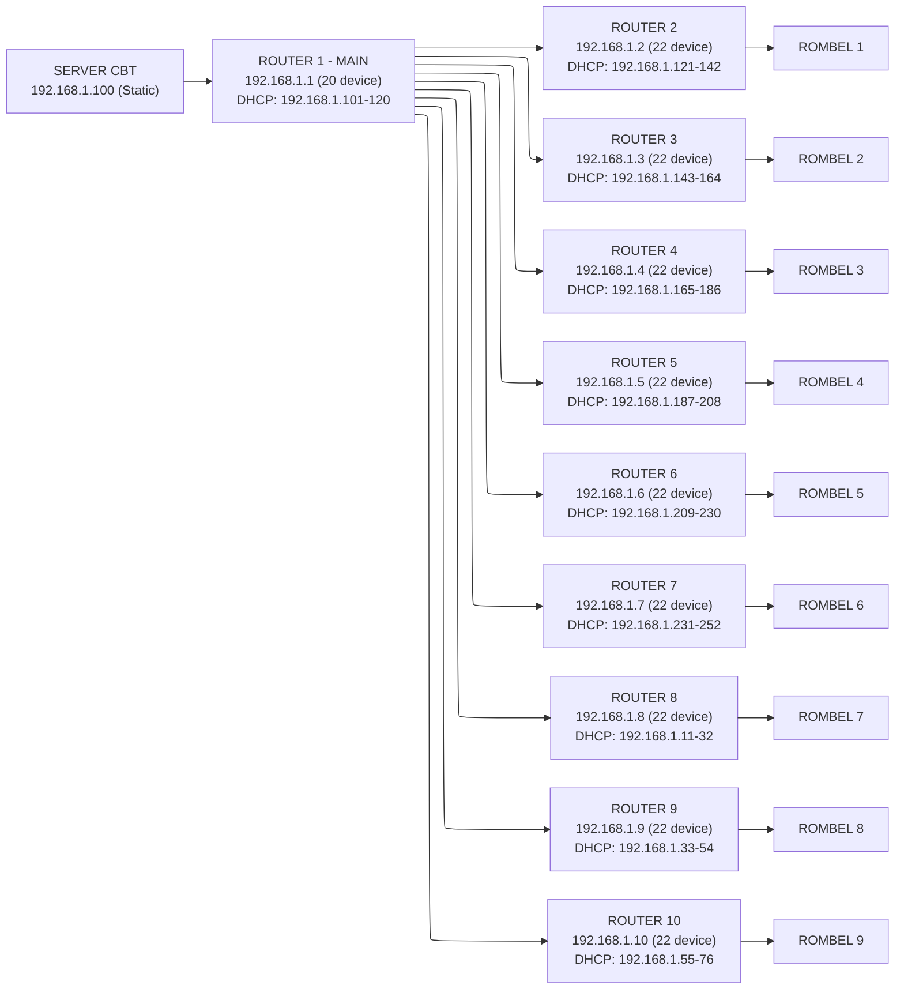

## Pendahuluan

Dokumen ini menjelaskan spesifikasi dan konfigurasi perangkat jaringan yang digunakan dalam sistem CBT offline untuk melayani 200 perangkat siswa yang terbagi dalam 9 rombongan belajar (rombel).

## Topologi Jaringan



## Perangkat Router/Access Point

### Spesifikasi TP-Link TL-WR840N

**Hardware Specifications:**

- **Chipset:** MediaTek MT7628N
- **Wireless Standard:** IEEE 802.11n/b/g
- **Frequency:** 2.4 GHz
- **Wireless Speed:** Up to 300 Mbps
- **LAN Ports:** 4x 10/100 Mbps
- **WAN Port:** 1x 10/100 Mbps
- **Antenna:** 2x Fixed Antenna
- **Power:** 9V/0.6A

**Software Features:**

- **Mode:** Router / Access Point / Range Extender / WISP
- **DHCP Server:** Built-in DHCP Server
- **NAT:** Support NAT
- **Firewall:** Basic SPI Firewall
- **QoS:** IP-based QoS
- **Wireless Security:** WPA/WPA2-PSK, WEP

**Keunggulan untuk CBT:**

- ✅ Harga terjangkau
- ✅ Mudah dikonfigurasi
- ✅ Stabil untuk 20-25 concurrent connections
- ✅ Mendukung mode Access Point
- ✅ DHCP Server terintegrasi

**Keterbatasan:**

- ⚠️ Hanya 2.4 GHz (prone to interference)
- ⚠️ Maximum 25-30 concurrent connections per device
- ⚠️ Port LAN hanya 100 Mbps (bukan Gigabit)

## Konfigurasi Jaringan

### Ringkasan Alokasi IP

| Router     | IP Address        | Gateway         | DHCP Pool         | Kapasitas  | Fungsi                       |
| ---------- | ----------------- | --------------- | ----------------- | ---------- | ---------------------------- |
| Router 1   | 192.168.1.1       | 192.168.1.1     | 192.168.1.101-120 | 20 device  | Main Router + Cadangan Admin |
| Router 2   | 192.168.1.2       | 192.168.1.1     | 192.168.1.121-142 | 22 device  | AP Rombel 1                  |
| Router 3   | 192.168.1.3       | 192.168.1.1     | 192.168.1.143-164 | 22 device  | AP Rombel 2                  |
| Router 4   | 192.168.1.4       | 192.168.1.1     | 192.168.1.165-186 | 22 device  | AP Rombel 3                  |
| Router 5   | 192.168.1.5       | 192.168.1.1     | 192.168.1.187-208 | 22 device  | AP Rombel 4                  |
| Router 6   | 192.168.1.6       | 192.168.1.1     | 192.168.1.209-230 | 22 device  | AP Rombel 5                  |
| Router 7   | 192.168.1.7       | 192.168.1.1     | 192.168.1.231-252 | 22 device  | AP Rombel 6                  |
| Router 8   | 192.168.1.8       | 192.168.1.1     | 192.168.1.11-32   | 22 device  | AP Rombel 7                  |
| Router 9   | 192.168.1.9       | 192.168.1.1     | 192.168.1.33-54   | 22 device  | AP Rombel 8                  |
| Router 10  | 192.168.1.10      | 192.168.1.1     | 192.168.1.55-76   | 22 device  | AP Rombel 9                  |
| **Server** | **192.168.1.100** | **192.168.1.1** | **-**             | **Static** | **CBT Server**               |

**Total Kapasitas:** 218 alamat IP untuk 200 perangkat + buffer

### Subnet dan Network Information

```
Network Address: 192.168.1.0
Subnet Mask: 255.255.255.0 (atau /24)
Usable IP Range: 192.168.1.1 - 192.168.1.254
Broadcast Address: 192.168.1.255
Total Usable Hosts: 254
```

## Perangkat Pendukung

### Kabel Jaringan

**Untuk Backbone (Router ke Router):**

- **Type:** UTP Cat6 atau Cat5e
- **Panjang:** Sesuaikan dengan jarak (maksimal 100 meter per segment)
- **Jumlah:** Minimal 10 kabel (1 untuk server ke router 1, 9 untuk router 1 ke router 2-10)
- **Rekomendasi:** Gunakan kabel dengan warna berbeda untuk identifikasi

**Untuk Server ke Router 1:**

- **Type:** UTP Cat6 (lebih baik untuk bandwidth tinggi)
- **Panjang:** Sesuaikan dengan jarak ruang server ke router utama
- **Connector:** RJ45 crimping berkualitas baik

### Switch (Opsional)

Jika jarak antar router terlalu jauh atau memerlukan manajemen kabel lebih baik:

- **Type:** Unmanaged Switch 16-24 Port Gigabit
- **Contoh:** TP-Link TL-SG1024D (24-Port Gigabit)
- **Fungsi:** Menghubungkan semua Access Point ke switch, kemudian switch ke Router 1
- **Keuntungan:**
  - Kabel management lebih rapi
  - Tidak perlu kabel terlalu panjang
  - Port Gigabit lebih cepat

### UPS untuk Perangkat Network

**Rekomendasi:**

- **Main Router (Router 1):** UPS 650VA (untuk router + switch jika ada)
- **Access Point (Router 2-10):** Bisa menggunakan power strip dengan surge protection
- **Prioritas:** Router 1 dan Server HARUS menggunakan UPS

## Persyaratan Lingkungan

### Penempatan Router/Access Point

**Router 1 (Main Router):**

- 📍 Tempatkan di lokasi sentral dekat server
- 📍 Akses mudah untuk administrator
- 🌡️ Ruangan ber-AC atau ventilasi baik
- 🔌 Dekat dengan power outlet dan UPS

**Router 2-10 (Access Point):**

- 📍 Tempatkan di setiap ruang rombel asesmen
- 📍 Posisi tinggi (di dinding atau ceiling mount) untuk coverage optimal
- 📍 Hindari penghalang besar (tembok tebal, lemari besi)
- 📍 Jarak antar Access Point minimal 5-10 meter (untuk mengurangi interferensi)

### Channel WiFi Management

**Untuk Menghindari Interferensi:**

Gunakan channel 1, 6, dan 11 (non-overlapping channels di 2.4 GHz):

```
Router 2 → Channel 1
Router 3 → Channel 6
Router 4 → Channel 11
Router 5 → Channel 1
Router 6 → Channel 6
Router 7 → Channel 11
Router 8 → Channel 1
Router 9 → Channel 6
Router 10 → Channel 11
```

**Catatan:** Router yang berjauhan bisa menggunakan channel yang sama.

## Konfigurasi Wireless

### SSID dan Password

**Rekomendasi untuk Seamless Roaming:**

Semua Access Point (Router 2-10) menggunakan:

- **SSID:** `ASESMEN-CBT` (atau nama yang sama)
- **Password:** Password yang sama dan kuat
- **Security:** WPA2-PSK (AES)
- **Keuntungan:** Siswa bisa berpindah ruangan tanpa harus reconnect WiFi

**Alternatif (untuk identifikasi per rombel):**

- **Router 2:** SSID `ASESMEN-R1`
- **Router 3:** SSID `ASESMEN-R2`
- **Router 4:** SSID `ASESMEN-R3`
- dst...

### Wireless Settings

```
Mode: 802.11n only (atau 802.11b/g/n mixed untuk kompatibilitas)
Channel Width: 20 MHz (untuk mengurangi interferensi)
Transmit Power: Maximum (untuk coverage optimal)
Wireless Security: WPA2-PSK (AES)
SSID Broadcast: Enable
WMM (Wi-Fi Multimedia): Enable
```

## Checklist Perangkat

### Perangkat Wajib

- [ ] 10x TP-Link TL-WR840N (atau router setara)
- [ ] 10x Power adapter untuk router
- [ ] 10x Kabel UTP Cat6 (panjang disesuaikan)
- [ ] 1x UPS 650VA untuk Router 1
- [ ] 1x Kabel tester untuk troubleshooting
- [ ] RJ45 connectors cadangan
- [ ] Crimping tool (untuk buat kabel sendiri jika diperlukan)

### Perangkat Opsional

- [ ] 1x Managed/Unmanaged Switch 24-Port Gigabit
- [ ] UPS tambahan untuk Access Point
- [ ] Cable management (cable ties, labels)
- [ ] WiFi Analyzer tool (untuk scan channel)
- [ ] Laptop untuk konfigurasi awal

## Estimasi Biaya (Referensi)

| Item                       | Qty   | Harga Satuan | Total            |
| -------------------------- | ----- | ------------ | ---------------- |
| TP-Link TL-WR840N          | 10    | Rp 150.000   | Rp 1.500.000     |
| Kabel UTP Cat6 (per meter) | 100m  | Rp 5.000     | Rp 500.000       |
| UPS 650VA                  | 1     | Rp 600.000   | Rp 600.000       |
| RJ45 Connector             | 30pcs | Rp 2.000     | Rp 60.000        |
| Cable Tester               | 1     | Rp 100.000   | Rp 100.000       |
| Switch 24-Port (Opsional)  | 1     | Rp 2.000.000 | Rp 2.000.000     |
| **TOTAL MINIMUM**          |       |              | **Rp 2.760.000** |
| **TOTAL WITH SWITCH**      |       |              | **Rp 4.760.000** |

_Harga dapat berbeda tergantung lokasi dan waktu pembelian_

## Bandwidth Calculation

### Per Device

- **Load Soal (avg):** 500 KB - 2 MB (tergantung gambar)
- **Submit Jawaban:** 50 KB - 200 KB
- **Bandwidth per Device:** ~1-2 Mbps peak, ~0.5 Mbps average

### Total Network

- **200 Devices:** 200 x 0.5 Mbps = 100 Mbps average
- **Peak Load:** 200 x 2 Mbps = 400 Mbps
- **Router Capacity:** 10 routers x 300 Mbps = 3000 Mbps (theoretical)
- **Bottleneck:** Server throughput dan switch backplane

**Kesimpulan:** Setup ini cukup untuk melayani 200 perangkat dengan margin yang baik.

## Troubleshooting Common Issues

### Siswa Tidak Bisa Connect WiFi

1. Cek apakah SSID terlihat di device siswa
2. Cek password WiFi benar
3. Cek jumlah connected devices tidak melebihi kapasitas (25-30 per AP)
4. Restart Access Point jika perlu

### Koneksi Lambat/Terputus

1. Cek interference dengan WiFi Analyzer
2. Ubah channel WiFi ke yang lebih sepi
3. Cek bandwidth usage di router
4. Cek apakah ada device yang download/streaming

### Tidak Bisa Akses Server

1. Ping ke 192.168.1.100 dari device siswa
2. Cek gateway setting di router (harus 192.168.1.1)
3. Cek kabel LAN dari Access Point ke Router 1
4. Cek server masih hidup dan web service running
